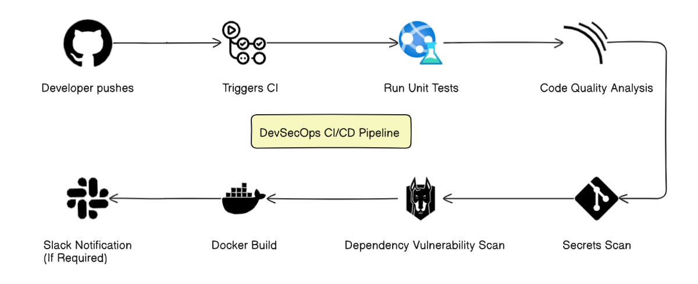

DevSecOps CI Pipeline
=====================

This repository demonstrates a fully functional DevSecOps Continuous Integration (CI) pipeline using GitHub Actions. It integrates static code analysis, secret scanning, unit testing, and dependency vulnerability scanning using open-source tools.

📌 Project Overview
-------------------

*   **Language:** Python
*   **CI/CD:** GitHub Actions
*   **Security Tools:** SonarCloud, Gitleaks, Snyk
*   **Testing Framework:** Pytest

🛠️ Tools Used
--------------

*   GitHub Actions
*   SonarCloud (Code Quality & Static Analysis)
*   Gitleaks (Secrets Detection)
*   Snyk (Vulnerability Scanning)
*   Pytest (Unit Testing)

📋 Steps to Run Locally
-----------------------

1.  Clone the repository:

    git clone https://github.com/trivediayush/devsecops-ci-pipeline.git
    cd devsecops-ci-pipeline

3.  Install dependencies:

    pip install -r requirements.txt

5.  Run unit tests:

    pytest tests/

7.  Optional: Run security scans locally

*   Gitleaks: `gitleaks detect --source . --config .gitleaks.toml`
*   Snyk: `snyk test`

📈 CI Pipeline Stages
---------------------

1.  Code Checkout
2.  Python Environment Setup
3.  Install Dependencies
4.  Run Unit Tests
5.  SonarCloud Scan
6.  Gitleaks Secret Scan
7.  Snyk Vulnerability Scan

🧭 Architecture Diagram
-----------------------

👤 Author
-----------------------

# Ayush Trivedi